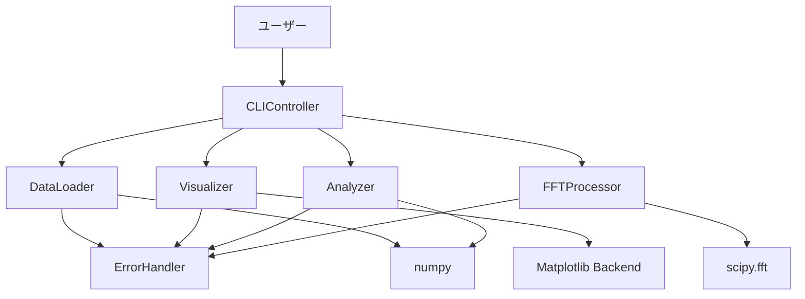
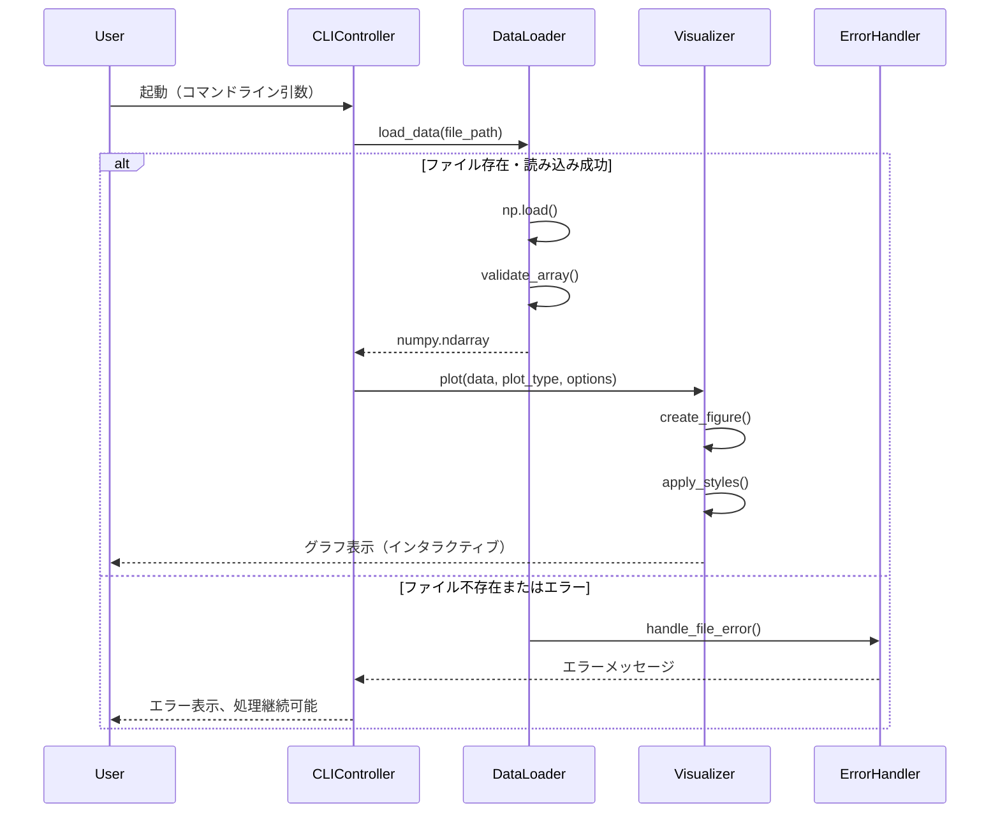
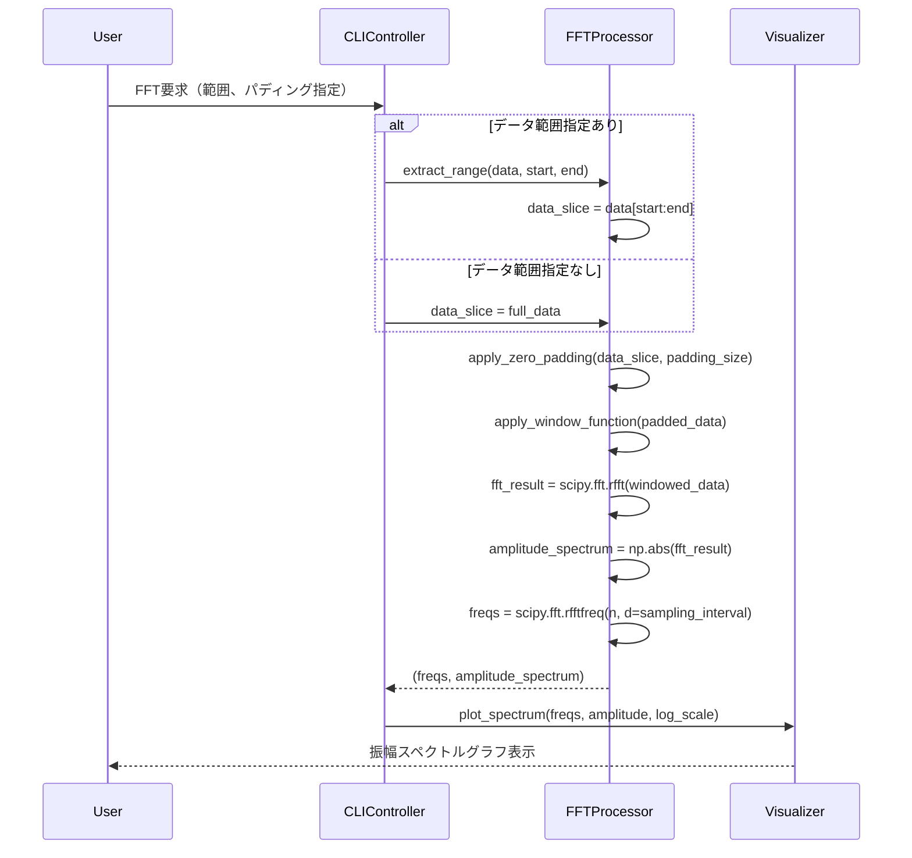
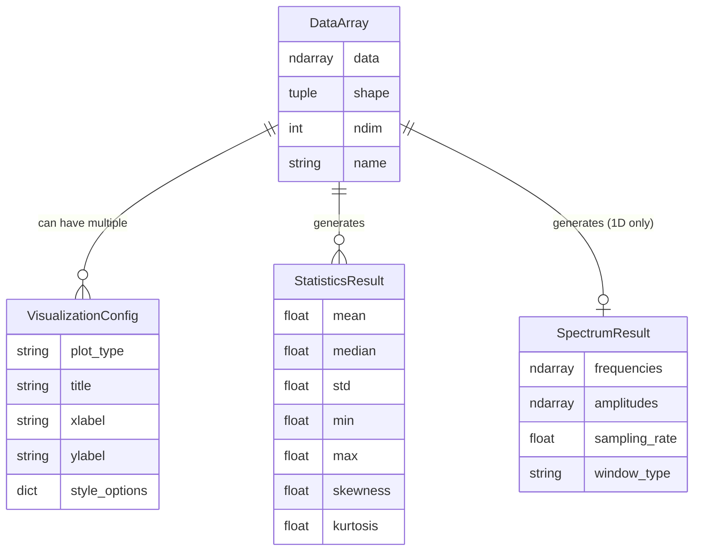

# Technical Design Document

## Overview

本機能は、科学データや数値データの探索的分析を支援するNumpy配列ベースのデータ可視化・分析ツールを提供します。データアナリストや研究者が時系列データや数値データを読み込み、視覚的に分析し、周波数特性を把握することを可能にします。

**Purpose**: 1次元を主とするNumpy配列データに対して、グラフ化、多様な可視化、統計分析、周波数解析（FFT）、インタラクティブな拡大表示機能を提供し、データの探索的分析ワークフローを効率化する。

**Users**: データアナリスト、研究者、科学技術者が、センサーデータ、時系列データ、実験データなどの数値解析と可視化のワークフローで利用します。

**Impact**: 既存システムなし（greenfield）。新規にPythonスクリプトとして開発され、コマンドライン引数またはインタラクティブモードで起動し、Numpy配列ファイル（.npy、.npz）を処理します。

### Goals

- 1次元Numpy配列を主対象とした効率的なデータ読み込みと処理
- 6種類以上の可視化タイプ（折れ線、散布図、棒グラフ、ヒストグラム、ヒートマップ、3D）のサポート
- FFTによる周波数解析と振幅スペクトル描画
- インタラクティブなズーム、パン、ツールチップ機能
- 基本統計量と分布特性の計算・表示
- コマンドライン引数とインタラクティブモードの両対応
- PNG、SVG、PDF形式でのグラフエクスポート

### Non-Goals

- Webベースのダッシュボード機能（ローカル実行に特化）
- リアルタイムストリーミングデータ処理
- 機械学習モデルの統合
- データベース統合（ファイルベース入力のみ）
- マルチユーザー/コラボレーション機能
- 4次元以上の高次元データ可視化

## Architecture

### Architecture Pattern & Boundary Map

**選択パターン**: モジュラーアーキテクチャ（MVC原則適用、厳格な実装は避ける）

**Rationale**:
- 8つの主要機能領域（データ読み込み、可視化、分析、FFT、UI、エラー処理）を明確に分離
- 各モジュールの単一責任原則により、保守性とテスト容易性を確保
- 将来の機能拡張（新しい可視化タイプ、分析手法）が容易
- 並列開発が可能（モジュール間インターフェースが明確）



**Domain Boundaries**:
- **Data Layer** (DataLoader): Numpy配列の読み込み、検証、メモリ管理
- **Visualization Layer** (Visualizer): グラフ生成、インタラクティブ機能、エクスポート
- **Analysis Layer** (Analyzer): 統計計算、相関分析、分布特性
- **Signal Processing Layer** (FFTProcessor): FFT処理、振幅スペクトル計算、ウィンドウ関数
- **Interface Layer** (CLIController): コマンドライン引数解析、インタラクティブメニュー、ワークフロー制御
- **Error Handling Layer** (ErrorHandler): 例外処理、ログ記録、エラーメッセージ生成

**Steering Compliance**: 標準ライブラリ優先（argparse）、科学計算の標準ツール（NumPy、SciPy、Matplotlib）を活用し、外部依存を最小化

### Technology Stack

| Layer | Choice / Version | Role in Feature | Notes |
|-------|------------------|-----------------|-------|
| Frontend / CLI | argparse (Python標準) | コマンドライン引数解析、ヘルプメッセージ生成 | 外部依存なし、軽量、要件6対応 |
| Backend / Services | Python 3.8+ | メインロジック、データ処理、分析エンジン | 型ヒント活用、標準ライブラリ活用 |
| Data / Storage | numpy 1.20+, scipy 1.7+ | Numpy配列読み込み（.npy/.npz）、FFT処理 | scipy.fft推奨（research.md参照） |
| Visualization | matplotlib 3.10+ | グラフ生成、インタラクティブバックエンド、エクスポート | GPU高速化、インタラクティブ対応 |
| Analysis | scipy.stats | 統計分析（歪度、尖度）、相関計算 | NumPy補完、高度な統計関数 |
| Interactive | mplcursors (optional) | ツールチップ、データポイント情報表示 | オプション依存、要件5.4対応 |
| Logging | logging (Python標準) | エラーログ、処理ログ記録 | 要件7.4対応 |

**Rationale**:
- **Matplotlib選択**: 1次元データの科学的可視化に最適、インタラクティブバックエンドでズーム/パン対応、NumPy統合強力（詳細はresearch.md参照）
- **scipy.fft選択**: numpy.fftより高機能、実信号最適化（rfft）でパフォーマンス50%向上、頻繁なメンテナンス
- **argparse選択**: 標準ライブラリで依存なし、要件の複雑さに十分対応可能

## System Flows

### データ読み込みと可視化フロー



### FFT処理と振幅スペクトル描画フロー



## Requirements Traceability

| Requirement | Summary | Components | Interfaces | Flows |
|-------------|---------|------------|------------|-------|
| 1.1 | .npy/.npzファイル読み込み | DataLoader | load_data() | データ読み込みフロー |
| 1.2 | ファイルパス指定で読み込み | CLIController, DataLoader | parse_args(), load_data() | データ読み込みフロー |
| 1.3 | ファイルエラー時の処理継続 | DataLoader, ErrorHandler | handle_file_error() | データ読み込みフロー |
| 1.4 | 1D/2D/3D配列サポート | DataLoader | validate_array() | - |
| 1.5 | .npz複数配列の識別保持 | DataLoader | load_npz() | - |
| 1.6 | 1列データの最適処理 | DataLoader | optimize_1d() | - |
| 2.1 | 1D配列で折れ線/棒グラフ | Visualizer | plot_1d() | 可視化フロー |
| 2.2 | 2D配列でヒートマップ/散布図/3D | Visualizer | plot_2d(), plot_3d() | 可視化フロー |
| 2.3 | グラフタイトル、軸ラベル、凡例 | Visualizer | set_labels() | - |
| 2.4 | 色、線、マーカーのカスタマイズ | Visualizer | apply_styles() | - |
| 2.5 | グラフ画面表示 | Visualizer | show() | 可視化フロー |
| 3.1 | 6種類の可視化タイプ | Visualizer | plot() | - |
| 3.2 | 可視化タイプ選択 | CLIController, Visualizer | select_plot_type(), plot() | - |
| 3.3 | 互換性チェックと代替案 | Visualizer | validate_plot_compatibility() | - |
| 3.4 | サブプロット配置 | Visualizer | create_subplots() | - |
| 3.5 | PNG/SVG/PDFエクスポート | Visualizer | export() | - |
| 4.1 | 基本統計量計算 | Analyzer | compute_basic_stats() | - |
| 4.2 | 分布特性（歪度、尖度） | Analyzer | compute_distribution_stats() | - |
| 4.3 | 欠損値/NaN検出 | Analyzer | detect_missing_values() | - |
| 4.4 | 相関行列計算と可視化 | Analyzer, Visualizer | compute_correlation(), plot_heatmap() | - |
| 4.5 | 分析結果出力（テキスト/CSV） | Analyzer | export_stats() | - |
| 5.1 | 領域選択で拡大表示 | Visualizer | enable_zoom_region() | - |
| 5.2 | マウスホイールズーム | Visualizer | enable_interactive_backend() | - |
| 5.3 | パン（ドラッグ移動） | Visualizer | enable_interactive_backend() | - |
| 5.4 | ツールチップ表示 | Visualizer | enable_tooltips() | - |
| 5.5 | 表示リセット | Visualizer | reset_view() | - |
| 6.1 | CLI引数受け取り | CLIController | parse_args() | - |
| 6.2 | 引数なしでヘルプ表示 | CLIController | show_help() | - |
| 6.3 | 無効引数でエラーとヘルプ | CLIController, ErrorHandler | handle_invalid_args() | - |
| 6.4 | インタラクティブメニュー/GUI | CLIController | interactive_mode() | - |
| 6.5 | 操作履歴/設定保存・復元 | CLIController | save_config(), load_config() | - |
| 7.1 | 100万要素を5秒以内に読み込み | DataLoader | load_data() | - |
| 7.2 | 処理進捗表示 | CLIController | show_progress() | - |
| 7.3 | メモリ不足時の安全終了 | ErrorHandler | handle_system_error() | - |
| 7.4 | 例外ログ記録 | ErrorHandler | log_exception() | - |
| 7.5 | 自動保存機能 | CLIController | auto_save() | - |
| 8.1 | 1DデータでFFT実行 | FFTProcessor | compute_fft() | FFTフロー |
| 8.2 | データ範囲指定で切り抜き | FFTProcessor | extract_range() | FFTフロー |
| 8.3 | ゼロパディング機能 | FFTProcessor | apply_zero_padding() | FFTフロー |
| 8.4 | 振幅スペクトル計算・描画 | FFTProcessor, Visualizer | compute_amplitude_spectrum(), plot_spectrum() | FFTフロー |
| 8.5 | 周波数（横）/振幅（縦）表示 | Visualizer | plot_spectrum() | FFTフロー |
| 8.6 | 周波数範囲設定 | Visualizer | set_frequency_range() | - |
| 8.7 | 対数スケール表示 | Visualizer | set_log_scale() | - |
| 8.8 | 範囲未指定でデータ全体FFT | FFTProcessor | compute_fft() | FFTフロー |

## Components and Interfaces

### Component Summary

| Component | Domain/Layer | Intent | Req Coverage | Key Dependencies (P0/P1) | Contracts |
|-----------|--------------|--------|--------------|--------------------------|-----------|
| DataLoader | Data Layer | Numpy配列ファイルの読み込み、検証、メモリ管理 | 1.1-1.6, 7.1 | numpy (P0), ErrorHandler (P0) | Service |
| Visualizer | Visualization Layer | グラフ生成、可視化、インタラクティブ機能、エクスポート | 2.1-2.5, 3.1-3.5, 5.1-5.5, 8.4-8.7 | matplotlib (P0), mplcursors (P1), ErrorHandler (P0) | Service |
| Analyzer | Analysis Layer | 統計計算、相関分析、分布特性 | 4.1-4.5 | numpy (P0), scipy.stats (P0), ErrorHandler (P0) | Service |
| FFTProcessor | Signal Processing Layer | FFT処理、振幅スペクトル計算、ウィンドウ関数 | 8.1-8.4, 8.8 | scipy.fft (P0), numpy (P0), ErrorHandler (P0) | Service |
| CLIController | Interface Layer | CLI引数解析、インタラクティブメニュー、ワークフロー制御 | 6.1-6.5, 7.2, 7.5 | argparse (P0), DataLoader (P0), Visualizer (P0), Analyzer (P1), FFTProcessor (P1) | Service |
| ErrorHandler | Error Handling Layer | 例外処理、ログ記録、エラーメッセージ生成 | 1.3, 6.3, 7.3, 7.4 | logging (P0) | Service |

### Data Layer

#### DataLoader

| Field | Detail |
|-------|--------|
| Intent | Numpy配列ファイル（.npy、.npz）の読み込み、検証、1次元データ最適化処理 |
| Requirements | 1.1, 1.2, 1.3, 1.4, 1.5, 1.6, 7.1 |
| Owner / Reviewers | - |

**Responsibilities & Constraints**
- Numpy配列ファイルの読み込みと形状検証
- .npzファイルの複数配列管理（配列名による識別）
- 1次元配列の最適化処理（flatten不要の検証）
- ファイル存在チェック、読み込みエラーハンドリング
- 大規模データ（100万要素以上）の効率的読み込み（5秒以内）

**Dependencies**
- Inbound: なし（エントリーポイント）
- Outbound: ErrorHandler - エラー処理とログ記録 (P0)
- External: numpy - 配列読み込み（np.load） (P0)

**Contracts**: Service [✓] / API [ ] / Event [ ] / Batch [ ] / State [ ]

##### Service Interface

```python
from typing import Union, Dict, Tuple
from pathlib import Path
import numpy as np

class DataLoader:
    def load_data(self, file_path: Path) -> Union[np.ndarray, Dict[str, np.ndarray]]:
        """
        Numpy配列ファイル（.npy、.npz）を読み込む

        Args:
            file_path: 読み込むファイルのパス

        Returns:
            .npyの場合: numpy.ndarray
            .npzの場合: Dict[配列名, numpy.ndarray]

        Raises:
            FileNotFoundError: ファイルが存在しない
            ValueError: ファイル形式が無効
            MemoryError: メモリ不足
        """
        pass

    def validate_array(self, array: np.ndarray) -> Tuple[bool, str]:
        """
        配列の形状と次元を検証

        Args:
            array: 検証対象の配列

        Returns:
            (検証成功, メッセージ)
        """
        pass

    def optimize_1d(self, array: np.ndarray) -> np.ndarray:
        """
        1次元配列の最適化（不要なreshapeを回避）

        Args:
            array: 最適化対象の配列

        Returns:
            最適化された1次元配列
        """
        pass
```

**Preconditions**:
- ファイルパスが有効なPathオブジェクト
- ファイルが.npyまたは.npz形式

**Postconditions**:
- 読み込み成功時、有効なnumpy.ndarrayまたは配列辞書を返す
- エラー時、適切な例外を送出しErrorHandlerに記録

**Invariants**:
- 読み込まれた配列は常にnumpy.ndarray型
- .npz配列辞書のキーは配列名文字列

**Implementation Notes**
- **Integration**: CLIControllerから呼び出され、読み込み結果をVisualizer、Analyzer、FFTProcessorに渡す
- **Validation**: ファイル拡張子チェック、np.load()の例外キャッチ、配列次元検証（1D-3D）
- **Risks**: 超大規模データ（数GB）でメモリ枯渇の可能性 → チャンク読み込みまたはメモリマップ検討（将来拡張）

### Visualization Layer

#### Visualizer

| Field | Detail |
|-------|--------|
| Intent | グラフ生成、6種類の可視化、インタラクティブズーム/パン、エクスポート機能 |
| Requirements | 2.1, 2.2, 2.3, 2.4, 2.5, 3.1, 3.2, 3.3, 3.4, 3.5, 5.1, 5.2, 5.3, 5.4, 5.5, 8.4, 8.5, 8.6, 8.7 |
| Owner / Reviewers | - |

**Responsibilities & Constraints**
- 6種類の可視化タイプ生成（折れ線、散布図、棒グラフ、ヒストグラム、ヒートマップ、3D）
- データ次元と可視化タイプの互換性検証
- インタラクティブバックエンド自動選択（Qt5Agg、TkAgg優先）
- ズーム、パン、ツールチップ機能の有効化
- PNG、SVG、PDFエクスポート
- サブプロット配置とレイアウト管理

**Dependencies**
- Inbound: なし
- Outbound: ErrorHandler - エラー処理とログ記録 (P0)
- External: matplotlib.pyplot - グラフ生成とバックエンド管理 (P0)
- External: mplcursors - ツールチップ表示（オプション） (P1)

**Contracts**: Service [✓] / API [ ] / Event [ ] / Batch [ ] / State [ ]

##### Service Interface

```python
from typing import Optional, List, Tuple, Literal
from pathlib import Path
import numpy as np
import matplotlib.pyplot as plt
from matplotlib.figure import Figure
from matplotlib.axes import Axes

PlotType = Literal["line", "scatter", "bar", "histogram", "heatmap", "3d"]
ExportFormat = Literal["png", "svg", "pdf"]

class Visualizer:
    def __init__(self):
        """
        Visualizerの初期化、インタラクティブバックエンド設定
        """
        pass

    def plot(
        self,
        data: np.ndarray,
        plot_type: PlotType,
        title: Optional[str] = None,
        xlabel: Optional[str] = None,
        ylabel: Optional[str] = None,
        style_options: Optional[dict] = None
    ) -> Tuple[Figure, Axes]:
        """
        指定された可視化タイプでグラフを生成

        Args:
            data: 可視化対象データ
            plot_type: 可視化タイプ
            title: グラフタイトル
            xlabel: x軸ラベル
            ylabel: y軸ラベル
            style_options: スタイルオプション（color, linestyle, marker等）

        Returns:
            (Figure, Axes)のタプル

        Raises:
            ValueError: データ次元と可視化タイプの不一致
        """
        pass

    def validate_plot_compatibility(self, data: np.ndarray, plot_type: PlotType) -> Tuple[bool, str]:
        """
        データ次元と可視化タイプの互換性を検証

        Args:
            data: 検証対象データ
            plot_type: 可視化タイプ

        Returns:
            (互換性あり, メッセージまたは代替案)
        """
        pass

    def enable_interactive(self, fig: Figure, ax: Axes) -> None:
        """
        ズーム、パン、ツールチップを有効化

        Args:
            fig: Figure オブジェクト
            ax: Axes オブジェクト
        """
        pass

    def plot_spectrum(
        self,
        freqs: np.ndarray,
        amplitude: np.ndarray,
        freq_range: Optional[Tuple[float, float]] = None,
        log_scale: bool = False
    ) -> Tuple[Figure, Axes]:
        """
        振幅スペクトルを描画

        Args:
            freqs: 周波数配列
            amplitude: 振幅配列
            freq_range: 周波数範囲 (min, max)
            log_scale: 対数スケール使用

        Returns:
            (Figure, Axes)のタプル
        """
        pass

    def export(self, fig: Figure, file_path: Path, format: ExportFormat) -> None:
        """
        グラフをファイルにエクスポート

        Args:
            fig: エクスポート対象Figure
            file_path: 出力ファイルパス
            format: 出力形式

        Raises:
            IOError: ファイル書き込みエラー
        """
        pass

    def create_subplots(self, nrows: int, ncols: int) -> Tuple[Figure, np.ndarray]:
        """
        サブプロット配置を作成

        Args:
            nrows: 行数
            ncols: 列数

        Returns:
            (Figure, Axes配列)のタプル
        """
        pass
```

**Preconditions**:
- データがnumpy.ndarray型
- 可視化タイプが定義されたPlotType
- インタラクティブバックエンドが利用可能（Qt、Tk等）

**Postconditions**:
- グラフ生成成功時、有効なFigureとAxesを返す
- エラー時、適切な例外を送出

**Invariants**:
- 1次元データは折れ線/散布図/棒グラフ/ヒストグラムに対応
- 2次元データはヒートマップ/散布図/3Dに対応
- インタラクティブ機能はバックエンド依存（利用不可時は警告）

**Implementation Notes**
- **Integration**: CLIControllerから呼び出され、DataLoader、Analyzer、FFTProcessorの結果を可視化
- **Validation**: `validate_plot_compatibility()`でデータ次元チェック、不一致時は代替案提示（例: 2D→ヒートマップ推奨）
- **Risks**: Qt/Tkがインストールされていない環境でインタラクティブ機能が動作しない → バックエンド自動選択とフォールバック実装

### Analysis Layer

#### Analyzer

| Field | Detail |
|-------|--------|
| Intent | 基本統計量、分布特性、相関分析、欠損値検出 |
| Requirements | 4.1, 4.2, 4.3, 4.4, 4.5 |
| Owner / Reviewers | - |

**Responsibilities & Constraints**
- 基本統計量計算（平均、中央値、標準偏差、最小値、最大値）
- 分布特性計算（歪度、尖度）
- 欠損値・NaN値の検出と報告
- 2次元データの相関行列計算
- 分析結果のテキスト/CSV出力

**Dependencies**
- Inbound: なし
- Outbound: ErrorHandler - エラー処理とログ記録 (P0)
- External: numpy - 統計計算 (P0)
- External: scipy.stats - 高度な統計関数（歪度、尖度） (P0)

**Contracts**: Service [✓] / API [ ] / Event [ ] / Batch [ ] / State [ ]

##### Service Interface

```python
from typing import Dict, Optional
from pathlib import Path
import numpy as np

class Analyzer:
    def compute_basic_stats(self, data: np.ndarray) -> Dict[str, float]:
        """
        基本統計量を計算

        Args:
            data: 分析対象データ

        Returns:
            統計量辞書 {mean, median, std, min, max}
        """
        pass

    def compute_distribution_stats(self, data: np.ndarray) -> Dict[str, float]:
        """
        分布特性を計算

        Args:
            data: 分析対象データ

        Returns:
            分布特性辞書 {skewness, kurtosis}
        """
        pass

    def detect_missing_values(self, data: np.ndarray) -> Dict[str, int]:
        """
        欠損値とNaN値を検出

        Args:
            data: 検査対象データ

        Returns:
            検出結果 {nan_count, inf_count, total_elements}
        """
        pass

    def compute_correlation(self, data: np.ndarray) -> np.ndarray:
        """
        相関行列を計算（2次元データ）

        Args:
            data: 2次元データ

        Returns:
            相関行列

        Raises:
            ValueError: データが2次元でない
        """
        pass

    def export_stats(
        self,
        stats: Dict[str, float],
        file_path: Path,
        format: Literal["txt", "csv"]
    ) -> None:
        """
        分析結果をファイルにエクスポート

        Args:
            stats: 統計量辞書
            file_path: 出力ファイルパス
            format: 出力形式

        Raises:
            IOError: ファイル書き込みエラー
        """
        pass
```

**Preconditions**:
- データがnumpy.ndarray型
- 相関計算は2次元データのみ

**Postconditions**:
- 統計量辞書を返す（キーは統計量名）
- エラー時、適切な例外を送出

**Invariants**:
- 欠損値検出は常にNaN、Inf、有限値の分類を返す
- 相関行列は正方行列（n×n、nは変数数）

**Implementation Notes**
- **Integration**: CLIControllerから呼び出され、結果をVisualizerで可視化またはファイルエクスポート
- **Validation**: 2次元チェック（compute_correlation）、NaN処理（統計計算前に警告）
- **Risks**: 大規模データで相関計算が遅延 → サンプリングオプション検討（将来拡張）

### Signal Processing Layer

#### FFTProcessor

| Field | Detail |
|-------|--------|
| Intent | FFT処理、振幅スペクトル計算、ゼロパディング、ウィンドウ関数適用 |
| Requirements | 8.1, 8.2, 8.3, 8.4, 8.8 |
| Owner / Reviewers | - |

**Responsibilities & Constraints**
- 1次元データに対するFFT処理（scipy.fft.rfft使用）
- データ範囲の切り抜き処理
- ゼロパディング適用（next_fast_len最適化）
- ウィンドウ関数適用（ハニング、ハミング、ブラックマン）
- 振幅スペクトル計算と周波数軸生成

**Dependencies**
- Inbound: なし
- Outbound: ErrorHandler - エラー処理とログ記録 (P0)
- External: scipy.fft - FFT計算（rfft, rfftfreq, next_fast_len） (P0)
- External: numpy - 配列操作、ウィンドウ関数 (P0)

**Contracts**: Service [✓] / API [ ] / Event [ ] / Batch [ ] / State [ ]

##### Service Interface

```python
from typing import Optional, Tuple, Literal
import numpy as np

WindowType = Literal["hanning", "hamming", "blackman", "none"]

class FFTProcessor:
    def extract_range(
        self,
        data: np.ndarray,
        start: Optional[int] = None,
        end: Optional[int] = None
    ) -> np.ndarray:
        """
        データ範囲を切り抜く

        Args:
            data: 元データ
            start: 開始インデックス
            end: 終了インデックス

        Returns:
            切り抜かれたデータ
        """
        pass

    def apply_zero_padding(self, data: np.ndarray, padding_size: Optional[int] = None) -> np.ndarray:
        """
        ゼロパディングを適用

        Args:
            data: パディング対象データ
            padding_size: パディング後のサイズ（Noneの場合、next_fast_len自動計算）

        Returns:
            パディングされたデータ
        """
        pass

    def apply_window_function(self, data: np.ndarray, window_type: WindowType) -> np.ndarray:
        """
        ウィンドウ関数を適用

        Args:
            data: 適用対象データ
            window_type: ウィンドウ関数タイプ

        Returns:
            ウィンドウ適用後のデータ
        """
        pass

    def compute_fft(
        self,
        data: np.ndarray,
        sampling_rate: float = 1.0,
        window_type: WindowType = "hanning",
        padding_size: Optional[int] = None
    ) -> Tuple[np.ndarray, np.ndarray]:
        """
        FFTを実行し振幅スペクトルと周波数軸を返す

        Args:
            data: FFT対象データ（1次元）
            sampling_rate: サンプリングレート（Hz）
            window_type: ウィンドウ関数タイプ
            padding_size: ゼロパディングサイズ

        Returns:
            (周波数配列, 振幅スペクトル配列)のタプル

        Raises:
            ValueError: データが1次元でない
        """
        pass
```

**Preconditions**:
- データが1次元numpy.ndarray
- sampling_rateが正の数

**Postconditions**:
- 周波数配列と振幅スペクトル配列を返す
- 配列長は元データ長//2 + 1（実信号のrfft）

**Invariants**:
- 周波数配列は0からナイキスト周波数まで単調増加
- 振幅スペクトルは非負値

**Implementation Notes**
- **Integration**: CLIControllerから呼び出され、結果をVisualizerのplot_spectrum()で描画
- **Validation**: 1次元チェック、sampling_rate > 0確認、ウィンドウ関数タイプ検証
- **Risks**: 不適切なパディングで周波数分解能が歪む → next_fast_len()使用、デフォルト値の適切な設定

### Interface Layer

#### CLIController

| Field | Detail |
|-------|--------|
| Intent | CLI引数解析、インタラクティブメニュー、ワークフロー制御 |
| Requirements | 6.1, 6.2, 6.3, 6.4, 6.5, 7.2, 7.5 |
| Owner / Reviewers | - |

**Responsibilities & Constraints**
- argparseによるコマンドライン引数解析
- 引数なし時のヘルプメッセージ表示
- 無効引数時のエラーとヘルプ表示
- インタラクティブメニューモード実装
- 操作履歴と設定の保存・復元（JSON形式）
- 処理進捗表示（tqdmまたはシンプルプログレスバー）
- 自動保存機能（異常終了時）

**Dependencies**
- Inbound: なし（エントリーポイント）
- Outbound: DataLoader - データ読み込み (P0)
- Outbound: Visualizer - グラフ生成 (P0)
- Outbound: Analyzer - 統計分析 (P1)
- Outbound: FFTProcessor - FFT処理 (P1)
- Outbound: ErrorHandler - エラー処理とログ記録 (P0)
- External: argparse - CLI引数解析 (P0)

**Contracts**: Service [✓] / API [ ] / Event [ ] / Batch [ ] / State [✓]

##### Service Interface

```python
from typing import Optional, Dict, Any
from pathlib import Path
import argparse

class CLIController:
    def __init__(self):
        """
        CLIControllerの初期化
        """
        pass

    def parse_args(self, args: Optional[list] = None) -> argparse.Namespace:
        """
        コマンドライン引数を解析

        Args:
            args: 引数リスト（テスト用、通常はNone）

        Returns:
            解析された引数オブジェクト
        """
        pass

    def interactive_mode(self) -> None:
        """
        インタラクティブメニューモードを起動
        """
        pass

    def save_config(self, config: Dict[str, Any], file_path: Path) -> None:
        """
        設定をファイルに保存

        Args:
            config: 設定辞書
            file_path: 保存先ファイルパス
        """
        pass

    def load_config(self, file_path: Path) -> Dict[str, Any]:
        """
        設定ファイルを読み込む

        Args:
            file_path: 設定ファイルパス

        Returns:
            設定辞書
        """
        pass

    def run(self) -> None:
        """
        メイン実行ロジック
        """
        pass
```

##### State Management

**State Model**:
- 設定状態: 最後に使用したファイルパス、可視化設定、FFTパラメータ
- セッション状態: 読み込まれたデータ、生成されたグラフ、分析結果

**Persistence & Consistency**:
- 設定はJSON形式で`~/.numpy_visualizer_config.json`に保存
- 自動保存は異常終了検出時にトリガー（signal.signal使用）

**Concurrency Strategy**:
- 単一ユーザー、単一プロセス想定（並行処理なし）

**Implementation Notes**
- **Integration**: すべてのコンポーネントのエントリーポイント、ワークフローを制御
- **Validation**: 引数の型チェック、ファイルパス検証、設定ファイルスキーマ検証
- **Risks**: 複雑なインタラクティブメニューの保守性 → シンプルなメニュー構造、各機能は個別モジュールに委譲

### Error Handling Layer

#### ErrorHandler

| Field | Detail |
|-------|--------|
| Intent | 例外処理、ログ記録、エラーメッセージ生成 |
| Requirements | 1.3, 6.3, 7.3, 7.4 |
| Owner / Reviewers | - |

**Responsibilities & Constraints**
- 全モジュールの例外処理
- ログファイルへの記録（`visualizer.log`）
- ユーザー向けエラーメッセージ生成
- システムエラー（メモリ不足）時の安全終了

**Dependencies**
- Inbound: すべてのコンポーネント
- Outbound: なし
- External: logging - ログ記録 (P0)

**Contracts**: Service [✓] / API [ ] / Event [ ] / Batch [ ] / State [ ]

##### Service Interface

```python
from typing import Optional
import logging

class ErrorHandler:
    def __init__(self, log_file: str = "visualizer.log"):
        """
        ErrorHandlerの初期化

        Args:
            log_file: ログファイルパス
        """
        pass

    def handle_file_error(self, error: Exception, file_path: str) -> str:
        """
        ファイル関連エラーを処理

        Args:
            error: 発生した例外
            file_path: エラーが発生したファイルパス

        Returns:
            ユーザー向けエラーメッセージ
        """
        pass

    def handle_system_error(self, error: Exception) -> None:
        """
        システムエラー（メモリ不足等）を処理し安全に終了

        Args:
            error: 発生したシステムエラー
        """
        pass

    def log_exception(self, error: Exception, context: Optional[str] = None) -> None:
        """
        例外をログファイルに記録

        Args:
            error: 記録する例外
            context: エラーのコンテキスト情報
        """
        pass
```

**Preconditions**:
- log_fileが書き込み可能

**Postconditions**:
- エラーメッセージを返すまたは表示
- ログファイルに例外情報が記録される

**Invariants**:
- すべてのエラーは必ずログ記録される

**Implementation Notes**
- **Integration**: 全モジュールから呼び出される共通エラーハンドラ
- **Validation**: ログファイルの書き込み権限チェック
- **Risks**: ログファイルが肥大化 → ローテーション機能検討（将来拡張）

## Data Models

### Domain Model

本機能のドメインモデルは以下のエンティティで構成されます：

**Entities**:
- **DataArray**: Numpy配列とメタデータ（形状、次元、配列名）
- **VisualizationConfig**: 可視化設定（プロットタイプ、スタイル、ラベル）
- **StatisticsResult**: 統計分析結果（基本統計量、分布特性）
- **SpectrumResult**: FFT結果（周波数配列、振幅スペクトル）

**Value Objects**:
- **PlotStyle**: グラフスタイル（色、線種、マーカー）
- **FFTConfig**: FFT設定（サンプリングレート、ウィンドウ関数、パディングサイズ）

**Domain Events**:
- DataLoaded: データ読み込み完了
- GraphGenerated: グラフ生成完了
- AnalysisCompleted: 分析完了

**Business Rules**:
- 1次元データのみFFT処理可能
- 2次元データのみ相関行列計算可能
- 可視化タイプはデータ次元に適合必須

### Logical Data Model

**Structure Definition**:



**Consistency & Integrity**:
- DataArrayは常に有効なnumpy.ndarray型
- VisualizationConfigのplot_typeはPlotType列挙型に制限
- StatisticsResultの全フィールドは非NULL（計算失敗時はNaN）

**Temporal Aspects**:
- セッション中のデータはメモリ保持（永続化なし）
- 設定のみJSON形式で永続化

### Physical Data Model

**For File-Based Storage** (設定ファイルのみ):

```json
{
  "last_file_path": "/path/to/data.npy",
  "default_plot_type": "line",
  "default_window": "hanning",
  "fft_config": {
    "sampling_rate": 1000.0,
    "padding_size": null
  },
  "style_preferences": {
    "color": "blue",
    "linestyle": "-",
    "marker": "o"
  }
}
```

**Schema**:
- last_file_path: string
- default_plot_type: PlotType列挙型
- default_window: WindowType列挙型
- fft_config: FFTConfig型
- style_preferences: PlotStyle型

### Data Contracts & Integration

**API Data Transfer**:
本機能はローカル実行のみでAPI公開なし。モジュール間は直接Pythonオブジェクト（numpy.ndarray、dict）で受け渡し。

**Event Schemas**:
将来の拡張（プラグインシステム）で使用可能なイベント定義：

```python
class DataLoadedEvent:
    data: np.ndarray
    file_path: Path
    timestamp: datetime

class GraphGeneratedEvent:
    figure: Figure
    plot_type: PlotType
    timestamp: datetime
```

## Error Handling

### Error Strategy

本機能は以下の3層エラーハンドリング戦略を採用：

1. **入力検証層**: ファイルパス、引数、データ形状の事前検証
2. **処理層**: 各モジュール内の例外キャッチとErrorHandler委譲
3. **ユーザー通知層**: 明確なエラーメッセージと代替案提示

### Error Categories and Responses

**User Errors (4xx相当)**:
- **ファイル不存在**: `FileNotFoundError` → エラーメッセージ表示、処理継続可能（要件1.3）
- **無効な引数**: `ValueError` → エラーメッセージとヘルプ表示（要件6.3）
- **データ次元不一致**: `ValueError` → 警告と代替案提示（要件3.3）

**System Errors (5xx相当)**:
- **メモリ不足**: `MemoryError` → 適切なエラーメッセージ、安全終了（要件7.3）
- **IO エラー**: `IOError` → エラーメッセージ、ログ記録（要件7.4）
- **インタラクティブバックエンド不可**: `ImportError` → 警告、静的バックエンドフォールバック

**Business Logic Errors (422相当)**:
- **FFTの1次元制約違反**: `ValueError` → エラーメッセージ「FFTは1次元データのみ対応」
- **相関行列の2次元制約違反**: `ValueError` → エラーメッセージ「相関行列は2次元データが必要」

### Monitoring

**Error Tracking**:
- logging.Loggerで全例外をログファイル（`visualizer.log`）に記録
- ログレベル: ERROR（システムエラー）、WARNING（ユーザーエラー）、INFO（正常処理）

**Health Monitoring**:
- 処理時間ロギング（大規模データの読み込み時間、FFT実行時間）
- メモリ使用量警告（閾値超過時）

## Testing Strategy

### Unit Tests

1. **DataLoader.load_data()**: .npy/.npz読み込み、ファイルエラーハンドリング、配列検証
2. **Visualizer.validate_plot_compatibility()**: データ次元と可視化タイプの互換性チェック
3. **Analyzer.compute_basic_stats()**: 統計計算の正確性、NaN処理
4. **FFTProcessor.compute_fft()**: FFT計算の正確性、周波数軸生成、ウィンドウ関数適用
5. **CLIController.parse_args()**: 引数解析、デフォルト値、バリデーション

### Integration Tests

1. **データ読み込み → 可視化フロー**: DataLoader → Visualizer → グラフ表示
2. **FFT処理フロー**: DataLoader → FFTProcessor → Visualizer.plot_spectrum()
3. **統計分析フロー**: DataLoader → Analyzer → 結果出力
4. **インタラクティブモード**: CLIController.interactive_mode() → 各機能の統合動作
5. **エラーハンドリングフロー**: 各モジュールのエラー → ErrorHandler → ログ記録

### E2E/UI Tests

1. **CLI引数モード**: `python visualizer.py data.npy --plot line` → グラフ表示
2. **FFT実行**: `python visualizer.py data.npy --fft --range 0:1000` → 振幅スペクトル表示
3. **インタラクティブモード**: `python visualizer.py` → メニュー選択 → 各機能実行
4. **エクスポート**: グラフ生成 → PNG/SVG/PDF保存 → ファイル検証
5. **エラーケース**: 無効ファイルパス → エラーメッセージ → ヘルプ表示

### Performance/Load Tests

1. **大規模データ読み込み**: 100万要素配列を5秒以内に読み込み（要件7.1）
2. **FFT処理**: 10万要素のFFTを2秒以内に完了
3. **複数サブプロット**: 10個のサブプロット生成を3秒以内に完了
4. **メモリ使用量**: 100万要素配列で500MB以下のメモリ使用

## Optional Sections

### Performance & Scalability

**Target Metrics**:
- データ読み込み: 100万要素配列を5秒以内（要件7.1）
- FFT処理: 10万要素を2秒以内
- グラフ生成: 基本プロット1秒以内
- メモリ使用: 読み込みデータサイズの2倍以下

**Optimization Techniques**:
- scipy.fft.rfftによる実信号最適化（計算時間50%削減）
- Matplotlibのインタラクティブバックエンドの遅延ロード
- 大規模データの進捗表示（要件7.2）でユーザー体験向上

**Scaling Approaches**:
- 現状は単一ファイル処理のみ
- 将来拡張: バッチ処理、チャンク読み込み、メモリマップ

### Security Considerations

**File Access**:
- ファイルパスの検証（ディレクトリトラバーサル攻撃対策）
- .npy/.npz形式のみ許可、実行可能ファイル拒否

**Dependency Security**:
- NumPy、SciPy、Matplotlibの信頼できるバージョン使用
- 定期的な依存ライブラリの脆弱性チェック

**Data Privacy**:
- ローカル実行のみ、ネットワーク通信なし
- ログファイルには個人データを記録しない

## Supporting References

なし（全情報は本設計ドキュメントに含まれています）
